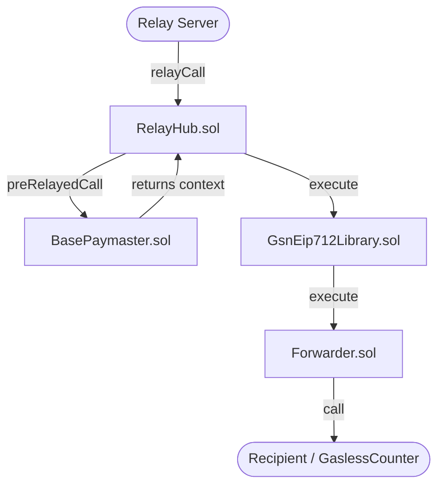

# Notes 1

This repo holds notes for an attempt at self-hosting the [AvaCloud Gas Relayer](https://docs.avacloud.io/portal/gasless-transactions/ava-cloud-gas-relayer-developer-guide) which seems to be using the [EIP-2771](https://eips.ethereum.org/EIPS/eip-2771) standard.

Through the AvaCloud Portal, a Gas Relayer deployment is:
- Forwarder Contract deployment and configuration
- Relayer funding
- Relayer deployment

The "Relayer deployment" is opaque but it could be a running a [GSN Relay Server](https://docs.opengsn.org/relay-server/tutorial.html).

## Setup

```bash
# Use our own fork of the GSN CLI
git clone -b foundry-migration git@github.com:AshAvalanche/gsn.git

# Follow the instructions in the README.md file to build the GSN CLI
```

## Deploy Relay Hub contract

```bash
export PK="0x..."

gsn deploy \
    --burnAddress 0x000000000000000000000000000000000000dead \
    --devAddress 0x92687d02e871D78f809bc2AFAC950bB39967E557 \
    --stakingToken 0x1111111111111111111111111111111111111111 \
    --skipConfirmation \
    --testPaymaster \
    -n $L1_RPC_URL \
    --privateKeyHex $PK
```

Output:

```bash
Deployed GSN to network: $L1_RPC_URL

  RelayHub: 0x0457d687553a2e904dc3a33e4f164c10e032dbc7
  RelayRegistrar: 0xf3552b2a6994f2c5b3ff3be9ea576676068b8b71
  StakeManager: 0x2b2ef0df274d6a45171977cc9044abaf7a2094e2
  Penalizer: 0xa38559a96b72900785d2b6d6367e29a0f343eaeb
  Forwarder: 0x0d447e6b755efab59091b00ac1dd4017eab29439
  TestToken (test only): 0x1111111111111111111111111111111111111111
  Paymaster (Default): 0xa94ef4de334965ded67944de5c9a4a6efd45ddad
```

## Run the relayer via Docker image

Edit the `gsn/dockers/config/gsn-relay-config.json` file to set the correct values, e.g.:

```json
{
  "url": "http://localhost",
  "workdir": "./app/data",
  "relayHubAddress": "0x0457d687553a2e904dc3a33e4f164c10e032dbc7",
  "managerStakeTokenAddress": "0x1111111111111111111111111111111111111111",
  "ownerAddress": "0x92687d02e871D78f809bc2AFAC950bB39967E557",
  "gasPriceFactor": 1,
  "ethereumNodeUrl": "$L1_RPC_URL"
}
```

Start the containers:

```bash
cd gsn/dockers
docker compose up -d
```

The relayer responds at `localhost:8080/getaddr` but we can see that it's not ready:

```json
{
  "relayWorkerAddress": "0xbfe2d11e86ffed5868d13b4a987b0b95136924fd",
  "relayManagerAddress": "0x49d562615542533d47e5d2553424503a2204f24f",
  "relayHubAddress": "0x0457d687553a2e904dc3a33e4f164c10e032dbc7",
  "ownerAddress": "0x92687d02e871D78f809bc2AFAC950bB39967E557",
  "minMaxPriorityFeePerGas": "1",
  "maxMaxFeePerGas": "500000000000",
  "minMaxFeePerGas": "1000000000",
  "maxAcceptanceBudget": "285252",
  "chainId": "40899",
  "networkId": "40899",
  "ready": false,
  "version": "3.0.0-beta.3"
}
```

Running `docker compose logs gsn`, we can see some pre-requisites are not met for the relayer to be ready:

```bash
gsn  | Not registered yet. Prerequisites:
gsn  | Balance        | wrong          | actual: 0 ETH (0x0000...000) | required: 0.1 ETH (0x0000...000)
gsn  | Stake          | wrong          | actual: 0 WSZKT (0x1111...111) | required: 0.000000000000000001 WSZKT (0x1111...111)
gsn  | Hub authorized | wrong
gsn  | Stake locked   | wrong
gsn  | Manager        | 0x49d562615542533d47e5d2553424503a2204f24f
gsn  | Worker         | 0xbfe2d11e86ffed5868d13b4a987b0b95136924fd
gsn  | Stake Owner    | not set yet
gsn  | Config Owner   | 0x92687d02e871D78f809bc2AFAC950bB39967E557
```

## Register the Relayer

We can manually fund the relayer's worker and manager address with ETH:

```bash
cast send 0xbfe2d11e86ffed5868d13b4a987b0b95136924fd --value 1ether --rpc-url $L1_RPC_URL --private-key $PK
cast send 0x49d562615542533d47e5d2553424503a2204f24f --value 1ether --rpc-url $L1_RPC_URL --private-key $PK
```

The relayer is happy in the logs:

```bash
gsn  | warn:    Worker Balance requirement is now satisfied
gsn  | Worker Balance | good           | actual: 1 ETH (0x0000...000) | required: 0.1 ETH (0x0000...000)
gsn  | warn:    Balance requirement is now satisfied
gsn  | Balance        | good           | actual: 1 ETH (0x0000...000) | required: 0.1 ETH (0x0000...000)
```

It attempts to register but can't because of staking requirements:

```bash
gsn  | debug:   will attempt registration: isRegistrationPending=false isRegistrationCorrect=false forceRegistration=true
gsn  | debug:   will not actually attempt registration - prerequisites not satisfied
```

Stake WETH with `relayer-register` command executor:

```bash
cast send 0x1111111111111111111111111111111111111111 "deposit()" --value 1ether --rpc-url $L1_RPC_URL --private-key $PK
```

Register the relayer:

```bash
gsn relayer-register \
    -n $L1_RPC_URL \
    --privateKeyHex $PK --relayUrl http://localhost:8080
```

Output:

```bash
Relay registered successfully! Transactions:
 [
  '0x90f7e225231ef2d21425dd136abd7298f3747d3abc7d8a6cb7ff7219b167f5a8',
  '0xee75cb9a831afb775c8aad21f6a48745039f40c2c29dee4967391b1c3c51849b'
]
```

We can see at `localhost:8080/getaddr` that the relayer is now ready:

```json
{
  "relayWorkerAddress": "0xbfe2d11e86ffed5868d13b4a987b0b95136924fd",
  "relayManagerAddress": "0x49d562615542533d47e5d2553424503a2204f24f",
  "relayHubAddress": "0x0457d687553a2e904dc3a33e4f164c10e032dbc7",
  "ownerAddress": "0x92687d02e871D78f809bc2AFAC950bB39967E557",
  "minMaxPriorityFeePerGas": "1",
  "maxMaxFeePerGas": "500000000000",
  "minMaxFeePerGas": "1000000000",
  "maxAcceptanceBudget": "285252",
  "chainId": "40899",
  "networkId": "40899",
  "ready": true,
  "version": "3.0.0-beta.3"
}
```

## Deploy trusted forwarder contract

Following the [AvaLabs docs](https://github.com/ava-labs/avalanche-evm-gasless-transaction) from this point.

## The domain separator and request type are registered with the trusted forwarder during the GSN contract deployment GSN CLI CMD

## Deploy a simple test `GaslessCounter` contract that is EIP-2771 compliant (forwarder address as constructor argument)

```bash
forge create \
    --private-key $PK \
    --rpc-url $L1_RPC_URL \
    --broadcast \
    src/GaslessCounter.sol:GaslessCounter \
    --constructor-args 0x0d447e6b755efab59091b00ac1dd4017eab29439
```

Output:

```bash
Deployer: 0x92687d02e871D78f809bc2AFAC950bB39967E557
Deployed to: 0x049B17E2E179a212e12713F9cC3df4563abE4345
Transaction hash: 0x77c09b8926548237b291c4c1e3c831cf8e2a14e6ea1e3862542c82e2592ad72d
```

## Test without gas

```bash
# THIS SHOULD FAIL
# account with no balance cannot send any transaction
# due to no gas
#
# private key "1af42b797a6bfbd3cf7554bed261e876db69190f5eb1b806acbd72046ee957c3"
# maps to "0xb513578fAb80487a7Af50e0b2feC381D0BD8fa9D"
cast send \
    --private-key=1af42b797a6bfbd3cf7554bed261e876db69190f5eb1b806acbd72046ee957c3 \
    --rpc-url $L1_RPC_URL \
    0x049B17E2E179a212e12713F9cC3df4563abE4345 \
    "increment()"
```

Output:

```bash
Error: Failed to estimate gas: server returned an error response: error code -32000: insufficient funds for transfer
```

Confirm that the transactions were NOT processed:

```bash
cast call \
    --rpc-url $L1_RPC_URL \
    0x049B17E2E179a212e12713F9cC3df4563abE4345 \
    "getNumber()" | sed -r '/^\s*$/d' | tail -1

cast call \
    --rpc-url $L1_RPC_URL \
    0x049B17E2E179a212e12713F9cC3df4563abE4345 \
    "getLast()"
```

## Test via Original [Gas Relayer Server](./original-avalanche-evm-gasless-transaction/src/gasless_counter_increment/mod.rs)

```bash
./target/release/avalanche-evm-gasless-transaction \
    gasless-counter-increment \
    --gas-relayer-server-rpc-url http://localhost:8080/relay \
    --chain-rpc-url $L1_RPC_URL \
    --trusted-forwarder-contract-address 0xdF73152d17f311118c3a723B016B98be1a2E1446 \
    --recipient-contract-address 0x049B17E2E179a212e12713F9cC3df4563abE4345 \
    --domain-name "my domain name" \
    --domain-version "1" \
    --type-name "my type name" \
    --type-suffix-data "bytes8 typeSuffixDatadatadatada)" \
    --skip-prompt
```

This previously failed with:

```bash
called `Result::unwrap()` on an `Err` value: JsonRpcClientError(SerdeJson { err: Error("invalid type: string \"Expected property `relayRequest` to exist in object\", expected struct JsonRpcError", line: 1, column: 62), text: "{\"error\":\"Expected property `relayRequest` to exist in object\"}" })
```

**Note:** The AvaLabs [docs](https://github.com/ava-labs/avalanche-evm-gasless-transaction?tab=readme-ov-file#step-8-test-counter-contract-in-rust) mention that "http://127.0.0.1:9876/rpc-sync is the gas relayer server RPC URL". In our case, the GSN Relayer has a `/relay` endpoint but it does not seem capable of handling JSON-RPC requests.

This is why we modified the rust client to use the standard HTTP POST method instead of EVM RPC calls.

## Test via modified [Gas Relayer Server](./avalanche-evm-gasless-transaction/src/gasless_counter_increment/mod.rs)

```bash
./target/release/avalanche-evm-gasless-transaction \
    gasless-counter-increment \
    --gas-relayer-server-rpc-url http://localhost:8080/relay \
    --chain-rpc-url $L1_RPC_URL \
    --trusted-forwarder-contract-address 0x0d447e6b755efab59091b00ac1dd4017eab29439 \
    --recipient-contract-address 0x049B17E2E179a212e12713F9cC3df4563abE4345 \
    --domain-name "GSN Relayed Transaction" \ # hardcoded in the relayer
    --domain-version "3" \ # hardcoded in the relayer
    --type-name "RelayRequest" \ # hardcoded in the relayer
    --type-suffix-data "RelayData relayData)RelayData(uint256 maxFeePerGas,uint256 maxPriorityFeePerGas,uint256 transactionCalldataGasUsed,address relayWorker,address paymaster,address forwarder,bytes paymasterData,uint256 clientId)" \ # hardcoded in the relayer
    --relay-worker-address "0xbfe2d11e86ffed5868d13b4a987b0b95136924fd" \
    --paymaster-contract-address "0x49d562615542533d47e5d2553424503a2204f24f" \
    --relay-hub-contract-address "0x0457d687553a2e904dc3a33e4f164c10e032dbc7"
    --skip-prompt
```

Output:

```bash
Transaction relayed successfully!
Response: {"signedTx":...}
```

# Notes 2

What's the propagation chain of a tx starting from the Rust client of avacloud using the relayer, the GSN contracts and ending with gaslessCounter.sol.

First, quick reminder that EIP-712 allows metadata to be anchored in a tx so that it is signed and the client can be assured of its integrity during execution. 

### Contracts propagation path



1. **[RelayHub.sol](packages/contracts/src/RelayHub.sol)**: The relay server calls `relayCall`. The hub builds `RelayCallData`, checks the EIP-712 structure size, and accounts for initial gas (`vars.initialGasLeft`).
2. **[BasePaymaster.sol](packages/contracts/src/BasePaymaster.sol)**: The hub makes a `preRelayedCall` to the paymaster (e.g., `AcceptEverythingPaymaster`), which checks if it's willing to pay for the tx and returns a context.
3. **[GsnEip712Library.sol](packages/contracts/src/utils/GsnEip712Library.sol)**: Back in the hub, it calls `execute` on the EIP712 library, which hashes the `RelayData` structures.
4. **[Forwarder.sol](packages/contracts/src/forwarder/Forwarder.sol)**: The library calls the forwarder's `execute`. The forwarder verifies the EIP-712 signature (`_verifySig`), checks the nonce, expiration, and finally executes the call on the recipient contract with the appropriate gas limits.

*Note: Gas usage and available gas are tracked throughout these steps (e.g. `vars.gasUsedToCallInner`).*

### EIP-712 Types and Hashes Mapping

The `GsnEip712Library` hashes the `RelayData` fields (maxFeePerGas, paymaster, relayWorker, etc.) alongside hardcoded constants to create a `suffixData`.

| EIP-712 Component | Value / Hardcoded Constant | Purpose |
| :--- | :--- | :--- |
| **Domain Version** | `"3"` | Used in `domainSeparator()` to build the EIP712Domain. |
| **RelayData Type** | `RelayData(uint256 maxFee... uint256 clientId)` | The definition of GSN custom fields appended to the execution request. |
| **Type Suffix** | `abi.encodePacked("RelayData relayData)", RELAYDATA_TYPE)` | Connects `RelayRequest` with the custom `RelayData` format. |

#### On-chain Registration

To allow the Forwarder to cryptographically verify the structs, these constants are registered in the Forwarder during deployment (or via the GSN CLI):

- `registerDomainSeparator("GSN Relayed Transaction", "3")` -> Updates `domains` registry.
- `registerRequestType("RelayRequest", <Type Suffix>)` -> Computes `RELAY_REQUEST_TYPEHASH` and updates `typeHashes` registry.

The entire purpose of constructing these structures and their hashes is to verify that all execution parameters and involved parties are perfectly matching the Forwarder's registry.

### Conclusion

If we want to natively adapt to Avacloud's way of doing things (which sends a raw opaque string `TYPE_SUFFIX_DATA` via CLI rather than encoding the real `RelayData` JSON payload), we must:

1. Deploy a **custom Forwarder** that bypasses `_getEncoded`'s hashing logic and accepts the raw string suffix instead.
2. Deploy a **custom GsnEip712Library** to remove the transmission of `RelayData` tuples.

**However, this breaks security.** By injecting a constant type string instead of dynamically hashing `RelayData`, the user's Ethereum signature would no longer cover crucial fields: who pays (`paymaster`), to whom, and for what fees (`maxFeePerGas`). A malicious relayer could intercept a valid transaction, change the paymaster, inflate the gas limits, and drain funds.

This is why modifying the Rust client to comply with standard GSN EIP-712 payloads is the only viable path to maintain security and interoperability.
